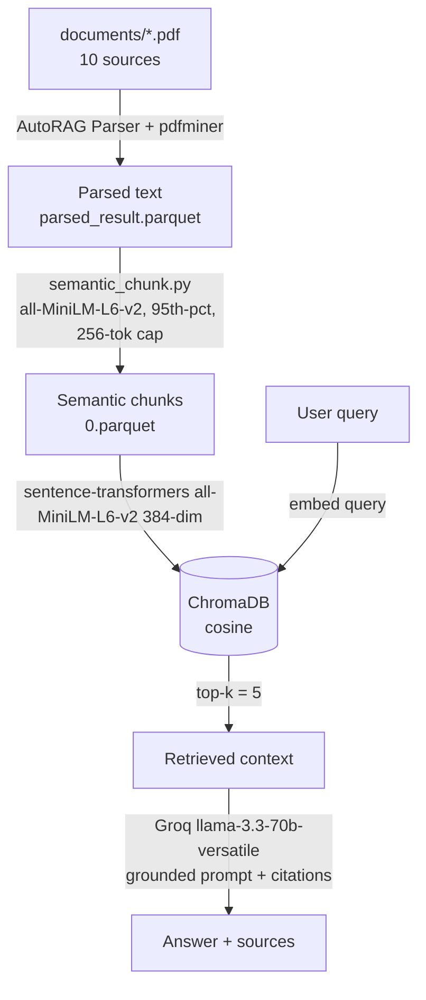

# Project 1 Planning: The Unofficial Guide

> Write this document before you write any pipeline code.
> Your spec and architecture diagram are what you'll use to direct AI tools (Claude, Copilot, etc.) to generate your implementation — the more specific they are, the more useful the generated code will be.
> Update the Retrieval Approach and Chunking Strategy sections if you change your approach during implementation.
> Update this file before starting any stretch features.

---

## Domain

Human Machine Interfaces (HMI) which is a subset of HCI (Human Computer Interfaces) -- the study of user interfaces and particular related to trust and various aspect of how to design them in the context of autonomous vehicles. This is useful because HMI studies don't not always focus on autonmous vehicles until recently. 

The reason it is not findable through official channels is due to niche nature and recency of the field. 

---

## Documents

## Document Sources

| # | Source | Type | URL or file path |
|---|--------|------|-----------------|
| 1 | *Trusting autonomous vehicles: An interdisciplinary approach* — Raats, Fors & Pink, Transportation Research Interdisciplinary Perspectives 7 (2020) 100201 | Peer-reviewed journal article | https://doi.org/10.1016/j.trip.2020.100201 · `documents/Trusting_autonomous_vehicles_An_interdisciplinary_.pdf` |
| 2 | *Human-Machine Interfaces and Vehicle Automation: A Review of the Literature and Recommendations for System Design, Feedback, and Alerts* — Mehrotra et al., UMass-Amherst / AAA Foundation for Traffic Safety (Nov 2022) | Research report | AAA Foundation for Traffic Safety · `documents/HMI-and-Automation-Design-Recommendations.pdf` |
| 3 | *"What's Happening" — A Human-centered Multimodal Interpreter Explaining the Actions of Autonomous Vehicles* — Luo et al., Monash University Malaysia (2025) | arXiv preprint | https://arxiv.org/abs/2501.05322 · `documents/2501.05322v2.pdf` |
| 4 | *Accessible Autonomous Vehicles: A Human-Computer Interaction Literature Review* — Mayas, Lengkong & Hirth, TU Ilmenau | ACM conference paper (systematic review) | https://doi.org/10.1145/3750069.3750162 · `documents/3750069.3750162.pdf` |
| 5 | *HMI design for autonomous vehicles* — Langlois (Renault), 13th IFAC Symposium on Analysis, Design & Evaluation of Human-Machine Systems, Kyoto (2016) | Conference paper (IFAC-PapersOnLine) | https://www.sciencedirect.com/science/article/pii/S2405896316322418 · `documents/1-s2.0-S2405896316322418-main.pdf` |
| 6 | *Evaluation of the human interaction with automated vehicles on highways* — Chand, Wang, Jashami & Hurwitz, Oregon State University (2024) | Peer-reviewed research article | `documents/e000078_Chand.pdf` |
| 7 | *Inclusive Design of Autonomous Vehicles: A Public Dialogue — Summary Report* — U.S. Access Board (July 2021) | Government public-dialogue report | U.S. Access Board · `documents/usab-av-forum-summary-report.pdf` |
| 8 | *NVIDIA Autonomous Vehicles Safety Report* — NVIDIA | Industry safety report / white paper | NVIDIA · `documents/auto-self-driving-safety-report.pdf` |
| 9 | *Human Computer Interaction (HMI) in autonomous vehicles for alerting driver during overtaking and lane changing* — Umachigi, Michigan Technological University (CS5760 Topic Paper) | Academic course paper | `documents/HCI_Topic_Paper.pdf` |
| 10 | *The influence of a color themed HMI on trust and take-over performance in automated vehicles* | Academic course paper | `documents/fpsyg-14-1128285 (4).pdf` |


---

## Chunking Strategy

<!-- How will you split documents into chunks?
     State your chunk size (in tokens or characters), overlap size, and explain why those
     numbers fit the structure of your documents.
     A review-heavy corpus warrants different chunking than a long FAQ. -->
I use **semantic chunking** (the `Semantic_llama_index` algorithm). Instead of cutting at a fixed
size, it splits where the embedding similarity between adjacent sentences drops — i.e. at natural
topic boundaries. The algorithm: (1) split each document into sentences; (2) embed each sentence
together with one neighbouring sentence on each side (`buffer_size = 1`) for context; (3) measure the
cosine distance between consecutive sentence-windows; (4) start a new chunk wherever that distance
exceeds the **95th percentile** (`breakpoint_percentile_threshold = 95`) of all distances in the document.

Embeddings for boundary detection use the same model as retrieval, `all-MiniLM-L6-v2`.

**Implementation note:** AutoRAG's built-in `Semantic_llama_index` chunker deadlocks on this machine
(its LlamaIndex `HuggingFaceEmbedding` backend hangs at 0% CPU on macOS + torch), so the identical
algorithm is implemented in `semantic_chunk.py` using `sentence-transformers` directly. Parsing still
uses AutoRAG (pdfminer).

**Chunk size:**

No fixed chunk size — boundaries are decided semantically, so chunks vary in length. I do enforce a
**hard cap of 256 tokens** per chunk (splitting any longer semantic segment on sentence boundaries),
because the embedding model `all-MiniLM-L6-v2` truncates anything past 256 tokens. Without this cap,
the tail of a long chunk would be silently dropped from its embedding and become unretrievable.
Measured result: mean ≈ 185 tokens, max 258, with all but one chunk within the 256-token window.

**Overlap:**

No overlap between final chunks. The `buffer_size = 1` window is only used to give each sentence
context *while detecting boundaries* — it does not duplicate text across the stored chunks. Overlap is
less important here than with fixed-size chunking because boundaries fall at topic shifts, so a single
idea is unlikely to be split across two chunks in the first place.

**Reasoning:**

I wanted boundaries decided by meaning rather than an arbitrary token count. Fixed-size token chunking
routinely severs a claim from its supporting evidence mid-sentence; semantic chunking keeps a coherent
idea together in one chunk. This matters for my corpus of dense academic papers on autonomous-vehicle
trust and HMI design, where the answer to a question is often a multi-sentence argument. Empirically it
also improved retrieval: top-result cosine distance on my trust test question dropped from 0.203 (token
chunking, 512/50) to 0.156 (semantic), i.e. tighter, more on-topic matches.

**Final chunk count:** 686 chunks across the 9 PDFs.

---

## Retrieval Approach

Embedding model: all-MiniLM-L6-v2 via sentence-transformers — 384-dimensional, 256-token input window, run locally on CPU. Chosen because it fits the free/local stack (no API key, no rate limits, nothing leaves the machine), is fast (embedded all 686 chunks in ~5s on CPU), and serves double duty as the boundary detector for semantic chunking — so chunking and retrieval share one embedding space.

**Embedding model:**
all-MiniLM-L6-v2 via sentence-transformers

**Top-k:**
Defined as TOP_K = 5 in RAG.py; retrieval pulls the 5 nearest chunks by cosine distance from ChromaDB and passes them as numbered context to the LLM. (Overridable per query with python RAG.py ask "..." -k 8.) 

**Production tradeoff reflection:**

Without cost being an issue we would prioritise having a larger context, higher accuracy model with more token window. 

Context length — the main driver. MiniLM's 256-token window is what forced my 256-token chunk cap and the truncation/bibliography-pollution issues in test.md. An 8k window removes the cap and lets whole semantic sections stay intact.

Accuracy on domain-specific text — MiniLM is a small general model; my one outright failure (Q3) was a vocabulary mismatch ("communicate intentions to pedestrians" vs the paper's "external communication"). Stronger models have better paraphrase matching and would likely recover it — though none are AV/HMI-fine-tuned, so it's an average gain, not guaranteed per term.

Latency — a cost, not a gain: MiniLM local is millisecond-fast with no network; an API model adds round-trip latency and rate limits, and a large local model needs a GPU to stay quick.
Multilingual — irrelevant now (all 9 sources are English), but if the corpus expanded I'd weigh a multilingual model (BGE-M3, multilingual-E5).

Local vs. API — local is free/private/offline; API trades per-token cost and sending document text off-box for managed scaling and bigger models.


---

## Evaluation Plan

| # | Question | Expected answer |
|---|----------|-----------------|
| 1 | What factors influence trust in autonomous vehicles? | Trust is shaped by three layers (Hoff & Bashir, 2015): *dispositional* factors (personality, age, gender, culture), *situational* factors (system performance, task/environment, level of effort), and *learned/dynamic* trust that develops through experience over time. |
| 2 | What are key recommendations for designing the human-machine interface (HMI) in automated vehicles? | Keep the driver engaged and informed of system status/actions; issue alerts and Requests to Intervene (RTI) that quickly orient the driver; use multimodal alerts (visual + auditory + tactile); scale how explicit the request is to the driver's engagement state (in/on/out-of-the-loop); synthesize existing guidelines for effective interfaces. |
| 3 | How should an autonomous vehicle communicate its intentions to pedestrians? | Via *external* HMI (eHMI) — external displays/visual signals — plus non-visual (auditory) cues for accessibility (pedestrians who are blind/low-vision or deaf). Covered by the accessible-AV HCI review and the U.S. Access Board report. *(This is the designed failure case — see test.md.)* |
| 4 | How does automation level affect driver situation awareness? | Higher automation (especially Level 3 / out-of-the-loop) tends to *reduce* situation awareness as the driver disengages; more lead time before a takeover and more specific alert cues improve situation awareness during the transfer of control. |
| 5 | What is the human-centered multimodal interpreter proposed to explain the actions of autonomous vehicles? | The "What's Happening" paper's **Human-centered Multimodal Interpreter** explains AV driving behavior to non-expert users via a visual interface (Bird's Eye View, maps, text) plus voice interaction driven by a fine-tuned LLM, giving real-time, concise explanations to improve transparency, trust, and acceptance. |

---

## Anticipated Challenges

1. **Noisy PDF extraction polluting retrieval.** The corpus is academic PDFs with multi-column
   layouts, equations, headers/footers, and — most importantly — large reference/bibliography
   sections. pdfminer flattens all of this into a single text stream (e.g. the arXiv sidebar in
   `2501.05322v2.pdf` comes out as a vertical run of single characters). The real danger is the
   reference lists: once chunked, a bibliography entry is dense with on-topic keywords
   ("autonomous vehicle", "pedestrian", "trust") but contains *no answer*, so it can rank highly on
   similarity and crowd out substantive passages. *Mitigation considered:* strip everything after a
   "References" heading before chunking. (This risk materialised — see the Q3 failure in `test.md`.)

2. **Silent truncation when a chunk exceeds the embedding window.** `all-MiniLM-L6-v2` truncates any
   input beyond 256 tokens, and it does so without error. A chunk longer than that would have its
   tail dropped from its embedding, making that text effectively unretrievable even though it is
   stored — a correctness bug that is invisible from reading answers. *Mitigation:* enforce a hard
   256-token cap during chunking (body packed to ≤226 tokens + filename prefix), verified by
   re-tokenising every chunk.

3. **Processing of non-text information like images and tables and flow charts won't be done correctly.** The processing extracts the text from the pdf as pure character stream and no image processing and extraction is done. 

---

## Architecture


```
   documents/*.pdf   (10 sources: journal articles, reports, preprints)
          │
          ▼
 ┌──────────────────────────────────────────────────────────────┐
 │ 1. DOCUMENT INGESTION      AutoRAG Parser + pdfminer           │
 │    PDFs ─► plain text                                          │
 │    config/parse_config.yaml ─► project/parse/parsed_result.parquet
 └──────────────────────────────────────────────────────────────┘
          │            (run:  python RAG.py ingest)
          ▼
 ┌──────────────────────────────────────────────────────────────┐
 │ 2. CHUNKING                semantic_chunk.py                   │
 │    all-MiniLM-L6-v2 for boundary detection                    │
 │    buffer_size=1 · breakpoint=95th pct · 256-token cap        │
 │    ─► project/chunk/0.parquet                                 │
 └──────────────────────────────────────────────────────────────┘
          │
          ▼
 ┌──────────────────────────────────────────────────────────────┐
 │ 3. EMBEDDING + VECTOR STORE   sentence-transformers + ChromaDB│
 │    all-MiniLM-L6-v2 (384-dim) ─► ChromaDB cosine, chroma_db/  │
 └──────────────────────────────────────────────────────────────┘
          │            (run:  python RAG.py index)
          ▼
   user query ─────────┐
          ▼            │
 ┌──────────────────────────────────────────────────────────────┐
 │ 4. RETRIEVAL                  ChromaDB semantic search        │
 │    embed query ─► top-k = 5 nearest chunks (cosine)           │
 └──────────────────────────────────────────────────────────────┘
          │            (top-5 chunks as numbered context)
          ▼
 ┌──────────────────────────────────────────────────────────────┐
 │ 5. GENERATION             Groq  llama-3.3-70b-versatile       │
 │    grounding prompt (answer only from context) + [source]     │
 └──────────────────────────────────────────────────────────────┘
          │            (run:  python RAG.py ask "...")
          ▼
   grounded answer  +  source filenames
```

Mermaid version (for renderers that support it):



---

## AI Tool Plan

**Milestone 3 — Ingestion and chunking:**

- *AI tool:* Claude (via Claude Code in the IDE).
- *Input I gave it:* the AutoRAG PyPI documentation, the `documents/` folder, and this file's
  **Chunking Strategy** section (semantic splitting, `buffer_size=1`, 95th-percentile breakpoint,
  256-token cap).
- *What I expected it to produce:* `config/parse_config.yaml` (pdfminer), a chunking config, and the
  ingestion code (`RAG.py ingest` + `semantic_chunk.py`) that turns `documents/*.pdf` into a chunk
  parquet.
- *How I verified it:* re-tokenised every chunk to confirm the 256-token cap held (mean ≈185, max
  258), inspected sample chunks for sane boundaries, and checked the chunk count.
- *What I changed / overrode:* AutoRAG's built-in `Semantic_llama_index` chunker deadlocked on this
  machine, so I directed Claude to re-implement the *same algorithm* with `sentence-transformers`
  instead; I also had it delete two byte-identical duplicate PDFs before ingestion.

**Milestone 4 — Embedding and retrieval:**

- *AI tool:* Claude (Claude Code).
- *Input I gave it:* this file's **Retrieval Approach** section and the required free/local stack
  (`all-MiniLM-L6-v2` via sentence-transformers, ChromaDB, top-k=5).
- *What I expected it to produce:* `RAG.py index` (embed every chunk and store it in a persistent
  ChromaDB collection) and `RAG.py`'s `retrieve()` (embed the query, return the top-k nearest chunks
  by cosine distance).
- *How I verified it:* ran smoke-test queries and read back the retrieved chunks and their cosine
  distances, confirming relevant chunks scored low (~0.16) and that ChromaDB used cosine space.
- *What I changed / overrode:* set the collection to cosine similarity to match normalised
  embeddings, and had retrieval print source + distance so retrieval quality is inspectable.

**Milestone 5 — Generation and interface:**

- *AI tool:* Claude (Claude Code).
- *Input I gave it:* the **Grounded Generation** requirement (answer only from retrieved context, no
  outside knowledge, cite sources) and the LLM choice (Groq `llama-3.3-70b-versatile`).
- *What I expected it to produce:* `RAG.py`'s `generate()` with a grounding system prompt and a
  numbered-context format, the `ask()` query path that prints the answer plus its source files, and
  the `python RAG.py ask "..."` command-line interface.
- *How I verified it:* ran the 5 evaluation questions (documented in `test.md`), checked that every
  answer carried `[filename]` citations and that the system correctly refused ("I don't have enough
  information…") when the retrieved context was too weak (the Q3 failure case).
- *What I changed / overrode:* tightened the system prompt to force an explicit refusal phrase rather
  than letting the model fall back on general knowledge, and surfaced retrieved sources in the CLI
  output for transparency.
